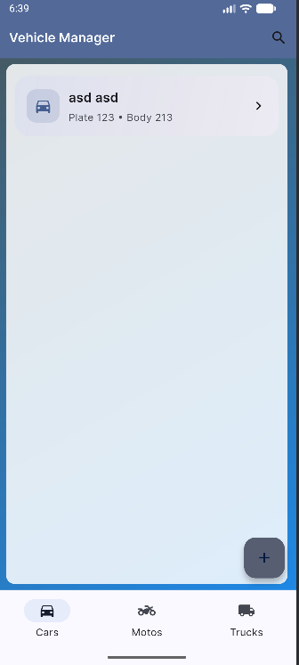
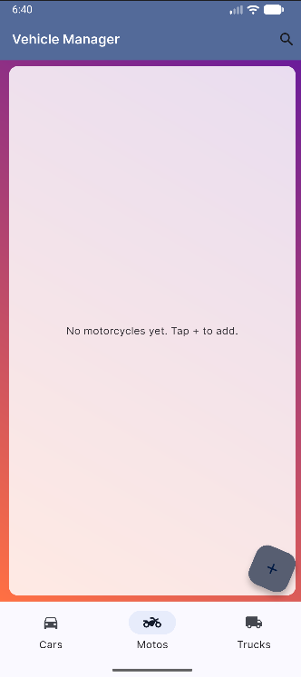
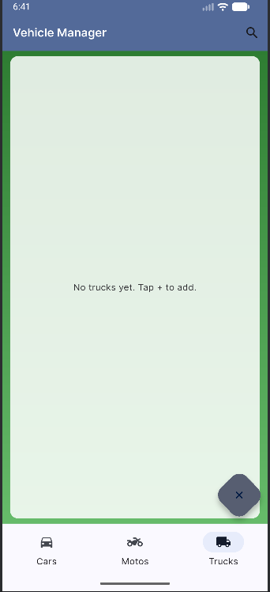
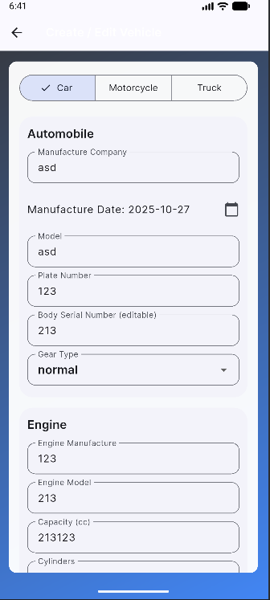

# Vehicle Management System

A sophisticated Flutter application for managing vehicle fleets with robust search capabilities and real-time data synchronization. Built with a clean architecture approach using domain-driven design principles.

## Overview

The Vehicle Management System (VMS) provides a modern, material-design interface for tracking and managing various vehicle types including cars, motorcycles, and commercial trucks. The application features real-time state management, persistent storage, and an intuitive search functionality.


### Vehicle Management Interface




### Vehicle Creation and Editing


## Architecture

The project follows a modular monorepo structure:

```
vehicle_mono/
├── packages/
│   ├── app_flutter/      # UI Layer & State Management
│   └── domain/          # Core Business Logic & Models
```

### Core Technologies

- **UI Framework**: Flutter with Material Design 3
- **State Management**: Provider pattern with ChangeNotifier
- **Data Persistence**: JSON-based local storage with atomic write operations
- **Architecture Pattern**: Clean Architecture with Domain-Driven Design
- **Testing**: Widget tests for UI components, unit tests for domain logic

### Key Features

- **Dynamic Vehicle Management**
  - Comprehensive CRUD operations for cars, motorcycles, and trucks
  - Optimistic UI updates with persistent storage
  - Swipe-to-delete with immediate state synchronization

- **Advanced Search Capabilities**
  - Multi-criteria search across vehicle types
  - Real-time filtering by company, plate number, and date
  - Optimized search algorithms for large datasets

- **Polished User Experience**
  - Animated transitions and micro-interactions
  - Responsive layout adapting to various screen sizes
  - Dark mode support with dynamic theming

- **Data Integrity**
  - Atomic write operations preventing data corruption
  - Validation rules enforced at domain layer
  - Type-safe models with immutable properties

## Technical Implementation

### Domain Layer

The domain package implements the core business logic and defines the contract between data layer and UI:

- **Models**: Immutable data classes for vehicles and components
- **Repositories**: Abstract interfaces for data operations
- **Services**: Business logic implementation including search and validation

### Application Layer

The Flutter application package implements the UI and state management:

- **State Management**: Hierarchical provider structure for efficient updates
- **UI Components**: Reusable widgets with consistent styling
- **Navigation**: Named routing with type-safe arguments
- **Theme**: Customizable material design implementation

## Performance Considerations

- Optimized list rendering with lazy loading
- Efficient memory usage through stream-based state updates
- Minimized rebuild scope using selective provider consumers
- Background processing for data operations

## Security

- Input sanitization at UI and domain layers
- Secure local storage with proper file permissions
- Type-safe operations preventing runtime errors
- Validation constraints enforced at domain boundary

## Changelog

### Latest Release

- Enhanced UI with animated transitions and polished visuals
- Implemented comprehensive search service
- Added persistent delete operations with immediate state updates
- Optimized build configuration and dependency management
- Resolved analyzer warnings and upgraded deprecated APIs

## Development Setup

### Prerequisites

- Flutter SDK (Latest stable version)
- Dart SDK (Latest stable version)
- Android Studio / VS Code with Flutter extensions
- Git for version control

### Getting Started

1. Clone the repository:
```bash
git clone https://github.com/islamyasin07/vehicle_mono.git
cd vehicle_mono
```

2. Install dependencies:
```bash
cd packages/app_flutter
flutter pub get
cd ../domain
dart pub get
```

3. Run the application:
```bash
cd ../app_flutter
flutter run
```

## Project Structure

```
packages/
├── app_flutter/           # Flutter application
│   ├── lib/
│   │   ├── core/         # App configuration, DI, routes
│   │   ├── pages/        # UI screens and business logic
│   │   ├── state/        # State management and providers
│   │   └── widgets/      # Reusable UI components
│   └── test/             # Widget and integration tests
│
└── domain/               # Core business logic
    ├── lib/
    │   ├── models/       # Domain entities
    │   ├── services/     # Business services
    │   └── data/         # Repository implementations
    └── test/             # Unit tests
```

## Contributing

### Code Style

The project follows official Dart and Flutter style guides:
- Use `flutter analyze` to ensure code quality
- Maintain consistent file structure
- Follow Material Design 3 guidelines for UI components

### Testing

```bash
# Run all tests
flutter test

# Run with coverage
flutter test --coverage
```

## License

This project is licensed under the MIT License - see the LICENSE file for details.

